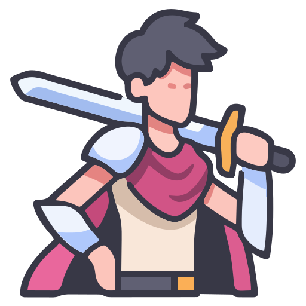

# 🌟 Portfolio

  <!-- Logo -->
  

### ✨ Full Stack Developer | Competitive Programmer | IIT Patna

<kbd>My space on the web</kbd> showcasing modern web development with stunning dark aesthetics

---

## 🎯 Overview

A modern, responsive portfolio website built with **Next.js 15** and **React 19**, featuring stunning dark aesthetics and smooth animations. This project showcases advanced web development practices with a focus on performance, accessibility, and user experience.

## ✨ Features

| Feature                      | Description                                             |
| ---------------------------- | ------------------------------------------------------- |
| 🎨 **Dark Luxury Theme**     | Ultra-dark design with purple accents and glass effects |
| ⚡ **Performance Optimized** | Next.js 15 with Turbopack for lightning-fast builds     |
| 📱 **Fully Responsive**      | Seamless experience across all device sizes             |
| 🎭 **Smooth Animations**     | Motion-powered interactions and transitions             |
| 📧 **Contact System**        | Integrated email functionality with React Email         |
| 🔍 **SEO Optimized**         | Complete meta tags, sitemap, robots.txt                 |
| 🛡️ **Security Headers**      | Enhanced security with proper headers configuration     |
| 📄 **PDF Resume**            | Integrated resume viewer with error boundaries          |
| 🎯 **Interactive UI**        | Modern glassmorphism and hover effects                  |

## 🛠️ Tech Stack

- **Frontend:** Next.js 15, React 19, TypeScript
- **Styling:** Tailwind CSS, Motion, Radix UI
- **Other:** React Email, Nodemailer

## 🎨 Design System

### **Color Palette**

| Color Category | HSL Value     | Usage                | Preview                                                            |
| -------------- | ------------- | -------------------- | ------------------------------------------------------------------ |
| **Background** | `240 15% 2%`  | Main background      |  |
| **Foreground** | `220 8% 94%`  | Primary text         |  |
| **Primary**    | `220 15% 88%` | Interactive elements |  |
| **Secondary**  | `275 60% 45%` | Accent elements      |  |
| **Accent**     | `275 70% 55%` | Highlights           |  |
| **Muted**      | `240 18% 6%`  | Subtle backgrounds   |  |
| **Card**       | `245 20% 3%`  | Component surfaces   |  |

### **Typography**

| Font Family      | Usage                 | Weight  | Characteristics            |
| ---------------- | --------------------- | ------- | -------------------------- |
| **Inter**        | Body text, paragraphs | 300-700 | Clean, readable, versatile |
| **Cutive Mono**  | Code, technical text  | 400     | Monospaced, technical feel |
| **Nasalization** | Main headings         | 400     | Futuristic, bold display   |
| **Quentine**     | Name, special text    | 400     | Elegant, signature style   |

---

**Built with ❤️ by Rittik Sharma**

